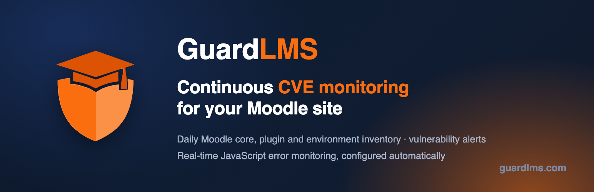

<p align="center">
  <a href="https://guardlms.com">
    
  </a>
</p>

# GuardLMS (local_guardlms)

[](https://github.com/LdesignMedia/moodle-local_guardlms/actions/workflows/ci.yml)

Continuous security monitoring for your Moodle site, connected in one click.

This local plugin links a Moodle site to [GuardLMS](https://guardlms.com). Once
connected, the plugin reports the Moodle version, the installed plugin
inventory, available updates and the server environment to GuardLMS once a day,
and can load the GuardLMS real-time monitoring script so JavaScript errors on
your site are reported as they happen. GuardLMS turns that data into CVE
alerts, update reminders, configuration reviews and error reports.

A free GuardLMS account is enough to get started.

## What the plugin does

- **One-click connect.** Click **Connect to GuardLMS** on the settings page,
  log in or register, confirm. The site is registered, ownership is verified
  through a meta tag the plugin serves, and a site-bound push key is installed.
  No API keys to copy, no web services, tokens or service users.
- **Daily inventory push.** A scheduled task sends the Moodle release and
  version, every installed plugin with its version and enabled state, the
  updates Moodle reports as available, the operating system, webserver and PHP
  configuration to GuardLMS over HTTPS.
- **Real-time JavaScript error monitoring** (Moodle 4.4 or later). With one
  checkbox the plugin loads the GuardLMS SDK on every page and reports browser
  errors with stack traces and context. No learner names, email addresses or
  user IDs are sent, and clicks and form entries are never recorded.
- **Optional page analytics.** On plans that include analytics, the same script
  can also send anonymous page views and scroll depth.
- **Optional configuration review.** Off by default. When enabled, a fixed list
  of security and session settings (cookie flags, session timeout, password
  policy, lockout threshold, self registration, and similar) is included so
  GuardLMS can review how the site is hardened. Secrets are never sent.
- **Clear connection status.** The settings page shows whether the site is
  connected, when it last pushed, when the key expires and whether GuardLMS
  has stopped accepting the key, so a silent site is never mistaken for a
  healthy one.

## What GuardLMS unlocks

The plugin is the sensor. GuardLMS is where the data becomes useful.

- **CVE matching.** Every plugin and the Moodle core version are matched
  against known vulnerabilities, with NVD integration, so a vulnerable
  component is flagged the day it becomes known.
- **Outdated component alerts.** Available updates for Moodle core and every
  plugin, taken from Moodle's own update checker, with alerts when something
  falls behind.
- **Environment intelligence.** PHP version, extensions, operating system,
  webserver and session store are tracked over time and matched against known
  vulnerabilities alongside the Moodle inventory.
- **Configuration review.** With the optional configuration section enabled,
  GuardLMS checks the reported settings against hardening best practices.
- **JavaScript error tracking.** Grouped errors with full stack traces,
  breadcrumbs of preceding navigation, network requests and console output,
  browser and device context, and rate limiting so a broken page does not
  flood you.
- **Everything else GuardLMS monitors** for the same site: uptime and SSL
  certificates, DNS and email security, security headers and cookie settings,
  performance, technology stack detection, health scores, automated security
  reports, and multi-tenant management for agencies and IT partners.

See the full [feature overview](https://guardlms.com/features) and
[plans](https://guardlms.com/pricing).

## Installation

1. Copy the plugin to `local/guardlms` in your Moodle root, or install it from
   Site administration > Plugins > Install plugins.
2. Visit Site administration to run the upgrade.

## Connect to GuardLMS

1. Open Site administration > Plugins > Local plugins > GuardLMS.
2. Click **Connect to GuardLMS**. Your browser is sent to GuardLMS where you log
   in or create a free account and confirm the connection.
3. Done. The site is registered in GuardLMS, site ownership is verified
   automatically, the push key is installed, and the first inventory push is
   queued.

The daily push runs from Moodle cron. You can also run it on demand from Site
administration > Server > Scheduled tasks ("Push site information to
GuardLMS"). If pushes ever fail or the push key is about to expire, open the
settings page and click **Reconnect**. **Disconnect** removes the key and stops
reporting.

### Connection status

The settings page shows one of three states:

| Status | Meaning |
| --- | --- |
| **Connected** | The push key works. Pushes are being accepted. |
| **Reconnect required** | GuardLMS refused this site's key (HTTP 401 or 403). The key was revoked, or the website it belonged to was removed from the GuardLMS dashboard. The site has stopped reporting; click **Reconnect** to issue a new key. |
| **Not connected** | No key is installed. |

"Reconnect required" also names the date of the first refused push, so it is
clear since when the site stopped reporting. The plugin never deletes the key on
its own: a GuardLMS outage that answers 401 for a while resolves itself, and the
state clears as soon as a push is accepted again.

## Real-time monitoring

Real-time monitoring needs a connected site and Moodle 4.4 or later, because
the script is injected through the Moodle Hooks API. On older Moodle versions
the checkbox is shown but has no effect.

### How it works

1. Connect the site. The plugin fetches its monitoring key and the SDK
   settings (script URL, endpoints, sample rates, ignored errors, allowed
   domains) from GuardLMS and caches them in plugin config.
2. Tick **Enable real-time monitoring** on the settings page and save.
3. From then on the GuardLMS SDK is loaded on every page. Browser errors are
   sent to GuardLMS in batches with the error message, script and line, stack
   trace, and a short trail of preceding page loads, network requests and
   console messages.

The SDK settings are refreshed from GuardLMS when the site connects, when the
plugin is upgraded, when the settings page is saved (through an ad hoc task on
cron) and when the settings page is opened after a while, so changes made in
the dashboard (sample rate, ignored errors, allowed domains, switching
monitoring off) reach the site without touching Moodle. The settings page also
has a **Refresh now** button and a **Send a test error** button to confirm the
pipeline end to end.

### Page analytics

**Enable page analytics** adds anonymous page views and scroll depth on top of
error reporting. It requires a GuardLMS plan that includes analytics; on other
plans the checkbox is disabled and error monitoring keeps working.

### What is and is not sent

- Sent: the page URL and referrer, the browser, operating system and window
  size, an anonymous session identifier that groups errors from one browsing
  session, and the error details listed above.
- Never sent: Moodle user IDs, names, email addresses, clicks, keystrokes or
  form entries.
- Scrubbed before sending: values of `sesskey`, `token`, `password`, `secret`,
  `apiKey`, `authorization` and `nonce` in URLs, stack traces and breadcrumbs.
- Dropped: known browser noise such as "Script error." and ResizeObserver
  warnings, plus whatever you add to the ignore list in the dashboard. Reports
  are also rate limited per minute.
- The anonymous session identifier is not the Moodle user ID and cannot be
  traced back to an account by GuardLMS.

The privacy provider describes the same data for the Moodle privacy API.

### Status messages

The real-time section on the settings page tells you why monitoring is or is
not active: not connected yet, key not fetched yet, ready to switch on, active,
no active subscription, switched off in the dashboard, domain mismatch between
the site URL and the allowed domains in GuardLMS, analytics not in your plan,
Moodle version too old, or the last refresh error.

## Daily inventory

The scheduled task builds a typed payload and sends it to the GuardLMS
endpoint, authenticated with the site's push key:

- `moodle`: release, version number, branch, every installed plugin as its
  frankenstyle component name, version, release, display name, standard/third
  party flag and enabled state, plus the updates Moodle itself reports as
  available for each of them
- `server`: operating system family, distribution and release, hostname,
  webserver name and version, and the session handler in use
- `php`: PHP version, SAPI, loaded `php.ini`, memory limit, max execution time,
  upload and post size limits, timezone and the loaded extensions
- `config` (optional, off by default): `cookiehttponly`, `cookiesecure`,
  `cookiesamesite`, `sessiontimeout`, `passwordpolicy`, `minpasswordlength`,
  `lockoutthreshold`, `opentogoogle`, `registerauth`, `authloginviaemail` and
  `protectusernames`

Plugin versions are reported with the raw values exactly as Moodle records them,
because GuardLMS matches CVEs on the component name and version.

### Available updates

Update information comes from Moodle's own update checker, so it is the same
list an admin sees under Site administration > Plugins > Plugins overview,
never a guess made by comparing version strings elsewhere.

That checker only reads the response cached by its last fetch. On a site whose
cron is broken, or where automatic checking is switched off, the cache is empty
or months old, and reporting it as-is would tell GuardLMS "no updates" when the
truth is "nobody looked". So the daily task refreshes the data itself whenever
the cache is older than 24 hours, and reports honestly when it cannot:

- `moodle.updatecheck` describes the state of the check: whether it is
  `enabled`, when it was `lastfetched`, whether the data is `stale`, and any
  `fetcherror` from the refresh attempt.
- Each plugin's `updates` key is **absent** when the data is stale, meaning
  "nobody checked", and **present but empty** when the plugin was checked and
  is current. GuardLMS relies on that distinction so an unchecked plugin is
  never displayed as up to date.
- `moodle.coreupdates` carries the same information for Moodle core, which the
  per-plugin API does not cover.

The refresh only happens on cron paths. The push that runs while an admin is
connecting the site stays on cached data, so the connect screen never blocks on
a request to download.moodle.org.

### Example payload

```json
{
  "platform": "moodle",
  "siteurl": "https://lms.example.com",
  "generatedtime": 1781308800,
  "moodle": {
    "release": "4.5.3+ (Build: 20250101)",
    "version": "2024100700.05",
    "branch": "405",
    "plugincount": 2,
    "plugins": [
      {
        "component": "mod_quiz",
        "type": "mod",
        "name": "quiz",
        "version": "2024100700",
        "versiondisk": "2024100700",
        "release": "4.5.3",
        "displayname": "Quiz",
        "isstandard": true,
        "enabled": 1,
        "updates": []
      },
      {
        "component": "local_guardlms",
        "type": "local",
        "name": "guardlms",
        "version": "2026061900",
        "versiondisk": "2026061900",
        "release": "1.1.0",
        "displayname": "GuardLMS",
        "isstandard": false,
        "enabled": -1,
        "updates": [
          {
            "version": "2026073100",
            "release": "1.5.0",
            "maturity": 200,
            "url": "https://moodle.org/plugins/local_guardlms"
          }
        ]
      }
    ],
    "updatecheck": {
      "enabled": true,
      "lastfetched": 1781305200,
      "stale": false,
      "fetcherror": null
    },
    "coreupdates": []
  },
  "server": {
    "os_family": "Linux",
    "os": "Linux",
    "hostname": "web01",
    "webserver": "Apache/2.4.58"
  },
  "php": {
    "version": "8.2.0",
    "sapi": "fpm-fcgi",
    "ini": "/etc/php/8.2/fpm/php.ini",
    "memory_limit": "512M",
    "max_execution_time": "30",
    "upload_max_filesize": "100M",
    "post_max_size": "100M",
    "timezone": "Europe/Amsterdam",
    "extensions": ["Core", "curl", "json", "..."]
  }
}
```

## Advanced settings (support and self-hosted only)

The settings page shows the Connect button, the connection status and the
real-time monitoring section, nothing else. The connection internals are hidden
so nobody can break a working setup by editing them. They are still reachable
by URL:

```
/admin/settings.php?section=local_guardlms&mode=advanced
```

That page exposes the GuardLMS base URL, the push path, the daily-push toggle,
an optional site URL override (for sites GuardLMS knows under a different
address), and the "Include Moodle configuration" toggle. The push key, the
monitoring key and the verification token are never editable: the connect flow
writes them.

To pin the base URL for good (self-hosted GuardLMS, or a development instance),
set it in `config.php` instead, which also makes it read-only in advanced mode:

```php
$CFG->forced_plugin_settings['local_guardlms']['baseurl'] = 'https://guardlms.example.com';
```

## Continuous integration

Every push to `main` and every pull request runs the workflow in
`.github/workflows/ci.yml`. It reuses the
[Catalyst Moodle workflows](https://github.com/catalyst/catalyst-moodle-workflows),
which wrap [moodle-plugin-ci](https://github.com/moodlehq/moodle-plugin-ci) and
run the same checks the Moodle plugins directory applies on submission: PHP
lint, code checker, PHPDoc checker, plugin validation, upgrade savepoints,
Mustache lint, Grunt, PHPUnit and Behat. Tests run against Moodle 4.5 through
5.2 on PHP 8.1 to 8.4 with both PostgreSQL and MariaDB.

Run the same checks locally before opening a pull request:

```bash
composer create-project -n --no-dev --prefer-dist moodlehq/moodle-plugin-ci ci ^4
export PATH="$(pwd)/ci/bin:$(pwd)/ci/vendor/bin:$PATH"
moodle-plugin-ci install --plugin ./moodle-local_guardlms --db-host=127.0.0.1
moodle-plugin-ci phplint && moodle-plugin-ci phpcs --max-warnings 0 && moodle-plugin-ci phpunit
```

## Requirements

- Moodle 3.9 or later for the daily inventory push.
- Moodle 4.4 or later for real-time monitoring (Hooks API).
- Outbound HTTPS from the Moodle server to GuardLMS for the push, and from
  learners' browsers to GuardLMS when real-time monitoring is enabled.

## Links

- [GuardLMS](https://guardlms.com)
- [Moodle plugins directory](https://moodle.org/plugins/local_guardlms)
- [Issues](https://github.com/LdesignMedia/moodle-local_guardlms/issues)

## License

GNU GPL v3 or later. See the [LICENSE](LICENSE) file for the full license text.
